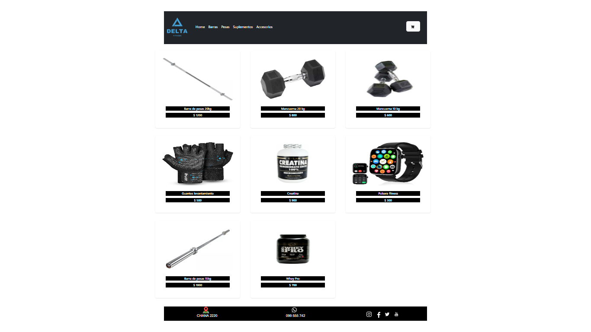

#PROYECTO DELTA FITNESS E-COMMERCE

Delta Fitness E-commerce es un proyecto de comercio electrónico diseñado para la venta de suplementos, pesas y accesorios relacionados con el fitness. El objetivo principal es proporcionar a los usuarios una plataforma intuitiva y atractiva para explorar y comprar productos relacionados con su entrenamiento físico.

Tecnologías Utilizadas
React: El proyecto se desarrolló utilizando React, un popular framework de JavaScript para construir interfaces de usuario interactivas.
Bootstrap: Se implementó Bootstrap para garantizar un diseño responsive y una apariencia moderna y consistente en todas las páginas del sitio.
CSS: Se aplicaron estilos personalizados mediante CSS para adaptar la apariencia y la experiencia del usuario según los requisitos del proyecto.
Firebase: La plataforma Firebase se utilizó para desarrolar la app y gestión de datos en tiempo real, la autenticación de usuarios y otras funcionalidades backend.

Instalación
Para ejecutar el proyecto localmente, sigue estos pasos:

Repositorio: git clone https://github.com/tuusuario/delta-fitness-ecommerce.git
Navega al directorio del proyecto: cd delta-fitness-ecommerce
Instala las dependencias: npm install
Inicia la aplicación: npm start
Uso
Una vez que la aplicación esté instalada y en funcionamiento, los usuarios pueden explorar los productos, agregar elementos al carrito y realizar compras de manera fácil y eficiente.

Autor
Nombre del Autor: Gaston Bohm
Contacto: gastonbohm@hotmail.com
Estado del Proyecto: finalizado

